# circuit-to-orcad

전자회로 부터 OrCAD 까지

## 전압 및 전류, 저항 기본

전기는 물의 흐름과 유사하다.

### 전하

물질이 띠고 있는 **전기적 성질의 기본단위**. 양전하와 음전하로 구분

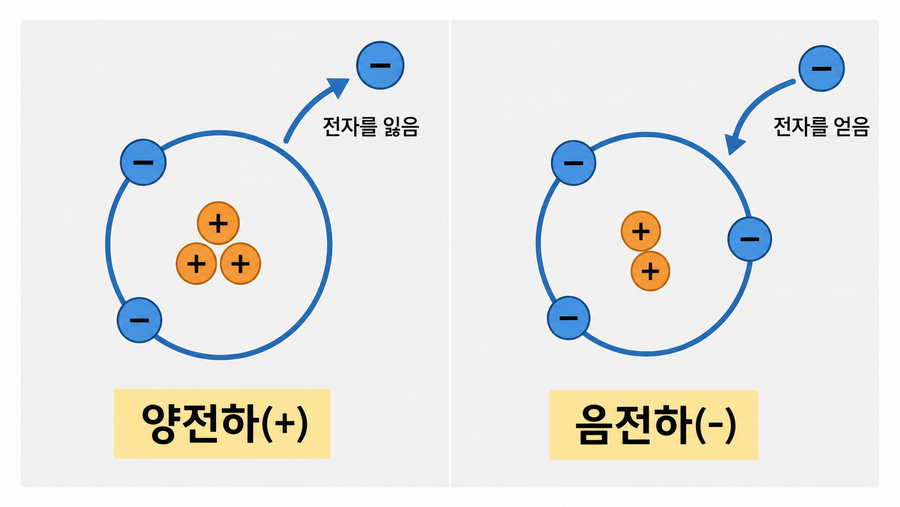

### 전압

- Voltage(V) : 압력, 전기 회로에서 **전하를 흐르게 하는 힘의 크기**를 의미. 단위는 `V`. 이를 물의 흐름으로 따지면 수압과 유사함.

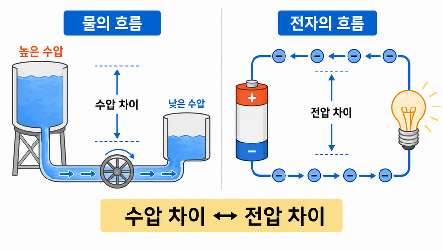

### 전류

- Current(I) : **전하의 흐름 자체** 의미. 흐르는 물의 양. 단위는 Ampere(`A`). 유량과 유사함.

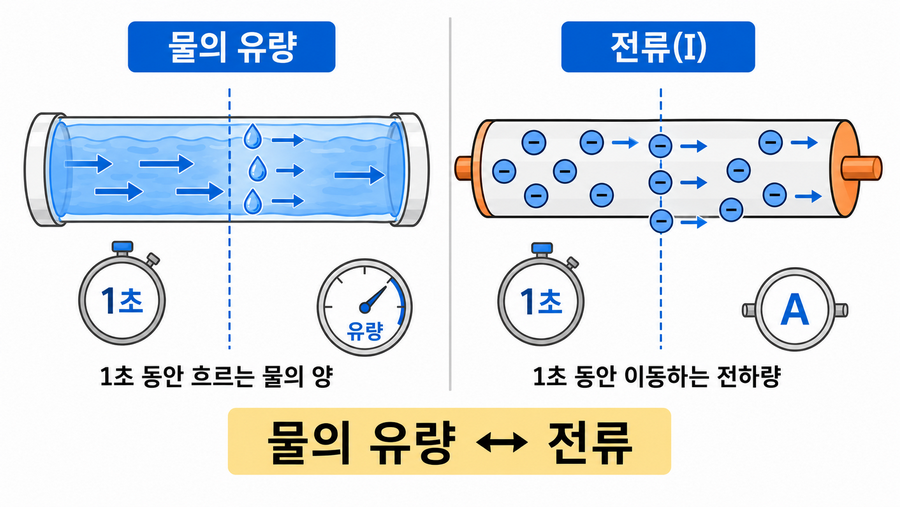

### 저항

- Resistance(R) : **전류의 흐름을 방해**하는 정도. 단위는 Ohm(`Ω`).

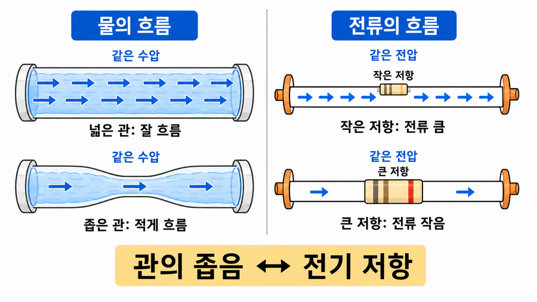

전압 = 전류와 저항의 곱

$$
V = I R
$$

### 전력

- Electric Power : 단위 **시간당 전기가 하는 일의 양**. 단위는 Watt(`W`).

전력 = 전압과 전류의 곱

$$
P = V I
$$

### 직렬과 병렬

| 구분            | 직렬 회로                    | 병렬 회로                   |
| --------------- | ---------------------------- | --------------------------- |
| 연결 모양       | 한 줄로 이어짐               | 여러 갈래로 나뉨            |
| 전류            | 모든 부품에 같은 전류가 흐름 | 갈래마다 전류가 나뉨        |
| 전압            | 부품마다 전압이 나눠짐       | 각 갈래에 같은 전압이 걸림  |
| 하나가 끊어지면 | 전체가 멈춤                  | 다른 갈래는 계속 동작 가능  |
| 예시            | 배터리 → 저항 → LED        | 여러 LED가 각각 전원에 연결 |

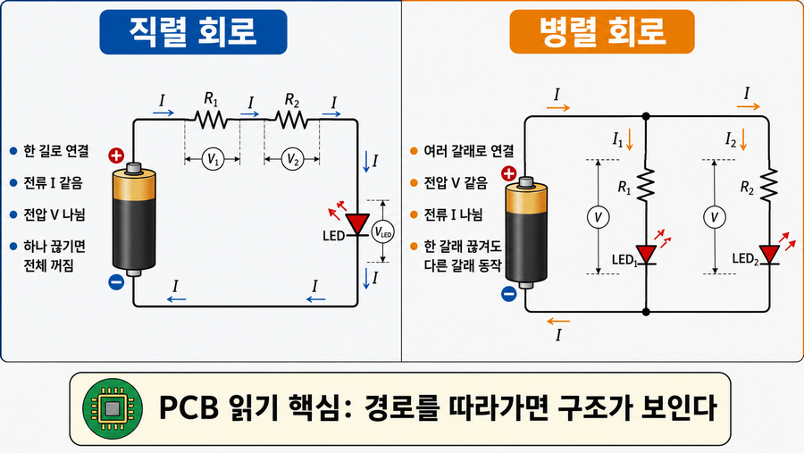

### 멀티미터 실습

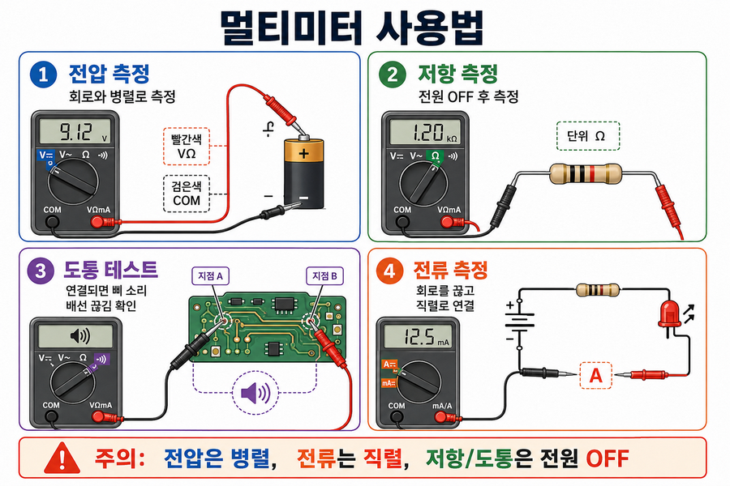

## 전자회로 학습

### 수동소자

#### 저항 Resistor

**전류의 흐름을 제한(방해)하는 부품**. `R`로 표시함

전기가 너무 많이 흐르면 LED가 타거나 IC가 고장날 수 있음. 이를 중간에 저항을 넣어서 흐르는 전류를 줄여주는 것

| 항목     | 내용                              |
| -------- | --------------------------------- |
| 이름     | 저항                              |
| 단위     | `Ω`옴                            |
| PCB 표시 | `R1`,`R2`,`R10`                   |
| 역할     | 전류 제한, 전압 분배, 신호 안정화 |
| 극성     | 없음                              |

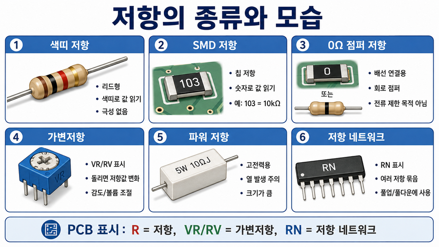

SMD(Surface Mounted Device) : 표면 실장 기기. 홀을 내는 납땜이 아닌 표면에 직접올려서 납땜하는 부품

##### 색띠 저항 읽는 법

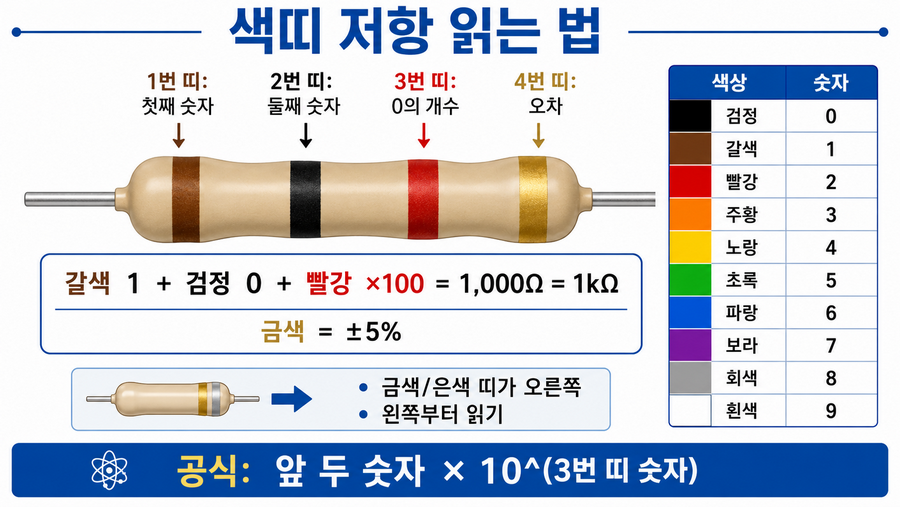

- 굳이 외울 필요는 없음

#### 가변 저항 Variable Resitor

**값을 바꿀 수 있는 저항**. 손잡이를 돌리거나 작은 나사를 돌려 저항값을 바꿈. 볼륨 조절, 밝기 조절, 센서 감도 조절 용도

가변저항을 보통 다리가 3개임.

`VR`또는 `RV`로 표시됨

| 항목     | 내용             |
| -------- | ---------------- |
| 이름     | 가변저항         |
| 단위     | `Ω`옴           |
| PCB 표시 | `VR`,`RV`        |
| 역할     | 조절 가능한 저항 |
| 극성     | 없음             |
| 다리 수  | 보통 3개         |

#### 커패시터 Capacitor

**전기를 잠시 저장하는 부품**. 아주 짧은 시간 저장했다가 필요할 때 전기를 내보내어 전압이 흔들릴 때 안정화하거나 노이즈 줄이는 데 사용

보통 콘덴서(일본식 표현), 축전기라는 이름으로도 불림

| 항목     | 내용                                |
| -------- | ----------------------------------- |
| 이름     | 커패시터                            |
| 단위     | `F`패럿                             |
| PCB 표시 | `C1`,`C2`,`C10`                     |
| 역할     | 전원 안정화, 노이즈 제거, 신호 필터 |
| 극성     | 종류에 따라 있음                    |

실제로는 `F`가 너무 큰 단위라 보통 `uF`, `nF`, `pF` 등을 사용.

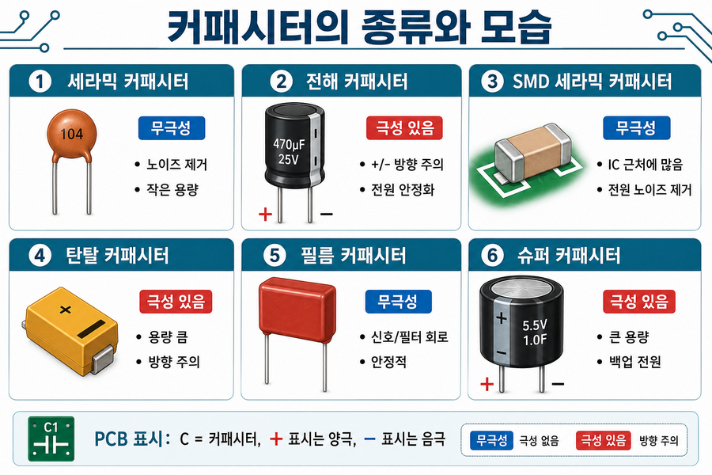

#### 다이오드 Diode

**전류를 한 방향으로만 흐르게** 하는 부품. 전기회로를 일방통행으로...

다이오드의 두 단자

| 단자      | 의미               |
| --------- | ------------------ |
| 애노드`A` | 전류가 들어가는 쪽 |
| 캐소드`K` | 전류가 나가는 쪽   |

전류 방향 애노드 A → 캐소드 K

- 역전압 보호, 정류(교류를 직류처럼), 신호방향 제어

PCB에서 다이오드는 `D1`, `D2`, `D5`처럼 표시

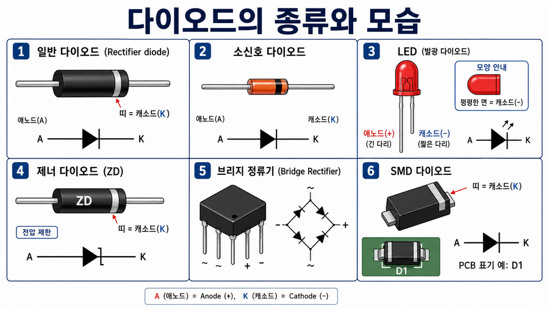

#### LED Light-Emitting Diode

발광 다이오드. **빛이 나는 다이오드**. LED 역시 방향이 맞아야 켜짐.

| 단자      | 의미  | 실제 구분            |
| --------- | ----- | -------------------- |
| 애노드`A` | `+`쪽 | 긴 다리              |
| 캐소드`K` | `-`쪽 | 짧은 다리, 평평한 면 |

LED는 그냥 전원에 바로 연결하지 않고, 반드시 **전류 제한 저항**이 필요

`LED1`, `D3`, `LD1`처럼 표시. LED 옆에 거의 항상 `R` 표시 저항이 붙어 있으면, 전류 제한 저항일 가능성 높음

#### 제너 다이오드 Zener diode

정해진 전압 이상이 되면 역방향으로 전류를 흘려서 전압을 제한. 회로가 너무 높은 전압을 받지 않게 막아주는 데 사용.

- 과전압 보호, 기준 전압 잡기, 신호 클램프(특정 전압 이상 오르지 않게 제한), IC보호

`ZD1`, `ZD2`, `D1`처럼 표시

##### 각 다이오드 비교

| 구분         | 다이오드          | LED                    | 제너 다이오드  |
| ------------ | ----------------- | ---------------------- | -------------- |
| 기본 역할    | 한 방향 전류 흐름 | 빛 출력                | 전압 제한      |
| 방향 중요    | 중요              | 중요                   | 중요           |
| 주 사용 방향 | 순방향            | 순방향                 | 주로 역방향    |
| PCB 표시     | `D`               | `LED`,`D`              | `ZD`,`D`       |
| 확인 포인트  | 띠가 캐소드       | 긴 다리 +, 짧은 다리 - | 제너 전압 확인 |

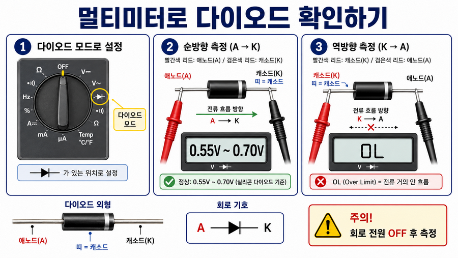

위 나머지 소자들 기호 정리

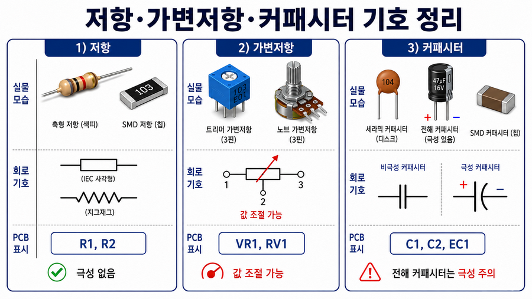

#### 트랜지스터 Transistor

**작은 전류로 큰 전류를 제어**하는 부품. 쉽게 말해 **전기로 켜고 끄는 스위치**를 의미함. 보통 `BJT`(바이폴라 접합) 트랜지스터를 의미함

스위치는 누르면 전등이 켜지는 것(전기가 흐름)과 같이, 작은 전기 신호로 큰 전류를 ON/OFF 하는 기능을 가진 부품을 말함.

##### 추가 설명

아두이노나 ESP32 같은 작은 신호로 모터, 버저, LED 같은 부품을 켤 때 필요함.

아두이노 핀은 전류를 많이 못흘림. 모터를 아두이노 핀에 직접 연결하면 핀이 망가짐.

트랜지스터를 중간에 넣어서 모터에 필요한 큰 전류

단자는 3개

| 단자 | 이름              | 역할               | 비유                 |
| ---- | ----------------- | ------------------ | -------------------- |
| `B`  | Base, 베이스      | 제어 입력          | 스위치 버튼          |
| `C`  | Collector, 컬렉터 | 전류가 들어오는 쪽 | 전기가 들어오는 입구 |
| `E`  | Emitter, 이미터   | 전류가 나가는 쪽   | 전기가 나가는 출구   |

#### MOSFET

트랜지스터와 다르게 **전압으로 제어**.

| 단자 | 이름          | 역할               |
| ---- | ------------- | ------------------ |
| `G`  | Gate, 게이트  | 제어 입력          |
| `D`  | Drain, 드레인 | 전류가 들어오는 쪽 |
| `S`  | Source, 소스  | 전류가 나가는 쪽   |

MOSFET은 전류를 많이 쓰는 부하에 자주 사용

- DC모터, LED 스트립, 릴레이, 히터, 전원 스위칭 등

##### 트랜지스터와 MOSFET 차이

| 구분       | 기억법                    |
| ---------- | ------------------------- |
| 트랜지스터 | 베이스에 전류를 넣어 켠다 |
| MOSFET     | 게이트에 전압을 넣어 켠다 |

실무적으로는

| 상황                     | 주로 선택  |
| ------------------------ | ---------- |
| 작은 신호 증폭           | 트랜지스터 |
| 간단한 소전류 스위칭     | 트랜지스터 |
| 모터·LED바·릴레이 제어 | MOSFET     |
| PWM 속도 제어            | MOSFET     |

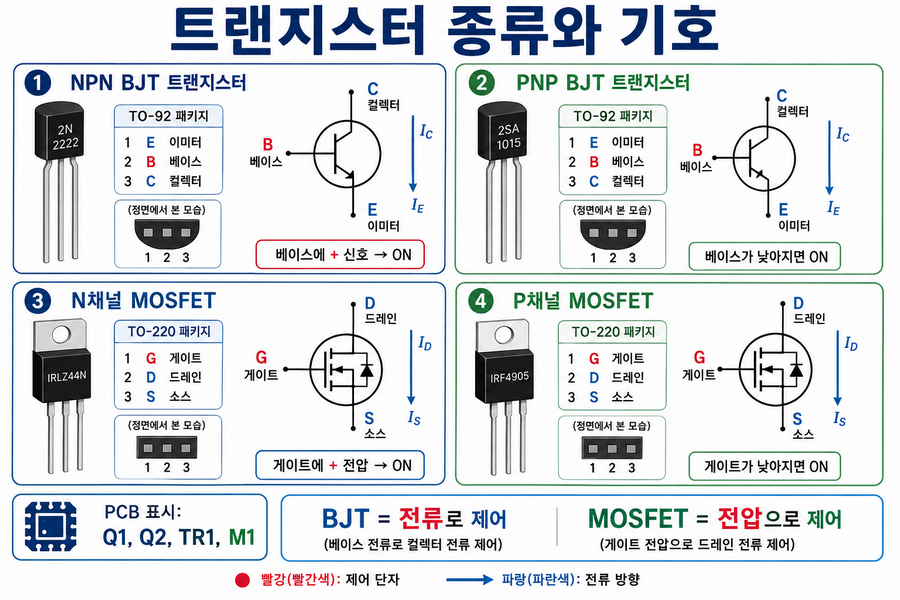
